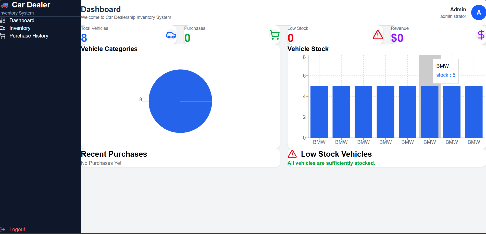
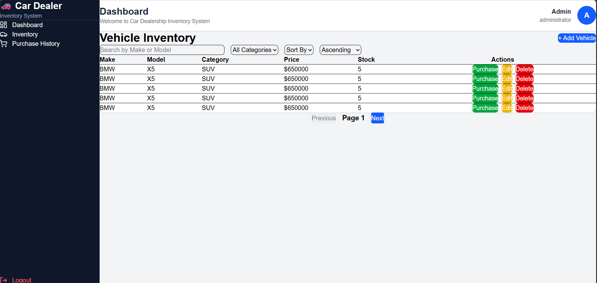
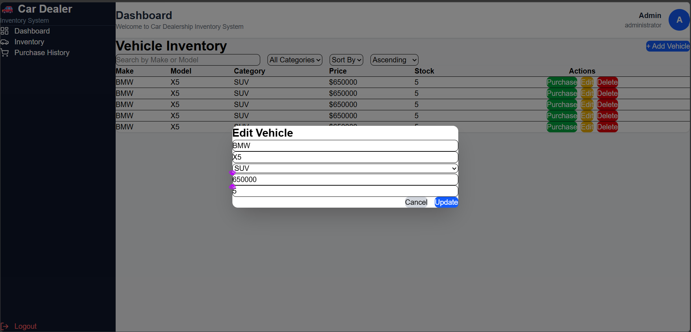
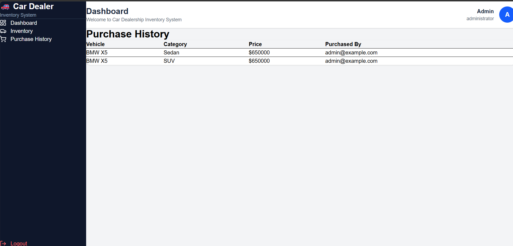

# 🚗 Car Dealership Inventory System

A full-stack **Car Dealership Inventory Management System** developed as a TDD-based assessment project.

The application provides authentication, vehicle inventory management, search and filtering, purchasing, restocking, purchase history, and an administrative dashboard.

## 🌐 Live Application

**Frontend:**
https://car-dealership-inventory-system-livid.vercel.app/

**Backend API:**
https://car-dealership-inventory-system-z808.onrender.com/

**API Documentation (Swagger):**
https://car-dealership-inventory-system-z808.onrender.com/docs

> **Important – First-time login**
>
> The deployed application uses a database-backed authentication system. For a fresh/deployed environment, please use the **Register** option first to create an account and then log in using the credentials you registered.
>
> If the Render free service has been inactive and spins down/restarts, its local SQLite database should not be treated as permanent production storage. Therefore, registering a new test account may be necessary when evaluating the live deployment.
>
> No personal or permanent credentials are included in this repository for security reasons.

---

# 📌 Project Overview

The Car Dealership Inventory System allows dealership users to manage vehicle inventory through a modern web interface.

The system includes:

* User registration and login
* JWT-based authentication
* Vehicle inventory management
* Vehicle search and filtering
* Vehicle sorting
* Pagination
* Vehicle purchasing
* Stock reduction after purchase
* Vehicle restocking
* Purchase history
* Low-stock monitoring
* Revenue tracking
* Inventory dashboard
* Admin vehicle management

The backend exposes RESTful APIs while the React frontend consumes those APIs.

---

# 🛠️ Tech Stack

## Backend

* Python 3.12
* FastAPI
* SQLAlchemy
* SQLite
* JWT Authentication
* Passlib / bcrypt
* Pytest
* Uvicorn

## Frontend

* React
* Vite
* Tailwind CSS
* Axios
* React Router
* Lucide React
* Framer Motion
* React Hot Toast

## Deployment

* **Frontend:** Vercel
* **Backend:** Render

## Development Tools

* Git
* GitHub
* VS Code
* Postman / Swagger UI
* ChatGPT for AI-assisted development

---

# 🏗️ Project Architecture

```text
car-dealership-inventory/
│
├── backend/
│   ├── app/
│   │   ├── auth/
│   │   ├── models/
│   │   ├── routes/
│   │   ├── schemas/
│   │   ├── database.py
│   │   └── main.py
│   │
│   ├── tests/
│   │   ├── conftest.py
│   │   ├── test_main.py
│   │   ├── test_vehicle.py
│   │   ├── test_purchase.py
│   │   └── test_dashboard.py
│   │
│   ├── requirements.txt
│   └── pytest.ini
│
├── frontend/
│   ├── src/
│   │   ├── api/
│   │   ├── components/
│   │   ├── layout/
│   │   ├── pages/
│   │   └── ...
│   │
│   ├── public/
│   └── package.json
│
├── README.md
├── PROMPTS.md
├── TEST_REPORT.md
└── .gitignore
```

---

# 🔐 Authentication

The application uses **JWT token-based authentication**.

### Registration

```http
POST /api/auth/register
```

Example:

```json
{
  "username": "admin",
  "email": "admin@example.com",
  "password": "password123"
}
```

### Login

```http
POST /api/auth/login
```

The backend returns an access token:

```json
{
  "access_token": "...",
  "token_type": "bearer"
}
```

The frontend stores the JWT token in browser `localStorage` and attaches it to protected API requests using the `Authorization` header.

---

# 🚘 Vehicle APIs

Protected endpoints include:

```text
POST   /api/vehicles
GET    /api/vehicles
GET    /api/vehicles/search
PUT    /api/vehicles/{id}
DELETE /api/vehicles/{id}
```

Additional inventory operations:

```text
POST /api/vehicles/{id}/purchase
POST /api/vehicles/{id}/restock
```

Vehicles contain information such as:

* ID
* Make
* Model
* Category
* Price
* Quantity in stock

---

# 📊 Dashboard

The dashboard provides an overview of the dealership inventory.

It displays:

* Total vehicles
* Total purchases
* Low-stock vehicles
* Revenue
* Vehicle categories
* Current vehicle stock
* Recent purchases

The dashboard consumes data directly from the FastAPI backend.

---

# 🔎 Inventory Features

The inventory interface supports:

### Search

Search vehicles by:

* Make
* Model

### Category filtering

Vehicles can be filtered by categories such as:

* SUV
* Sedan
* Hatchback
* Luxury

### Sorting

Vehicles can be sorted by:

* Price
* Stock quantity
* Make

Both ascending and descending order are supported.

### Pagination

Inventory results are displayed using pagination to avoid loading the entire inventory at once.

---

# 🛒 Purchasing

Users can purchase vehicles directly from the inventory interface.

When a purchase is successful:

1. The purchase request is sent to the backend.
2. The vehicle stock quantity is decreased.
3. A purchase record is created.
4. The inventory is refreshed.
5. A success notification is displayed.

The purchase button is disabled when a vehicle has no stock.

---

# 📦 Restocking

Administrative users can increase vehicle inventory through the restocking functionality.

Restocking updates the vehicle quantity in the database.

---

# 🧪 Test-Driven Development

This project was developed following a **Red → Green → Refactor** workflow wherever applicable.

The backend contains automated tests using `pytest`.

The test suite covers:

### Authentication

* User registration
* Password hashing
* Login
* JWT authentication

### Vehicle Management

* Adding vehicles
* Retrieving vehicles
* Searching vehicles
* Updating vehicles
* Deleting vehicles
* Sorting
* Pagination
* Low-stock functionality
* Restocking

### Purchase Module

* Purchasing vehicles
* Stock reduction
* Purchase history

### Dashboard

* Vehicle count
* Total stock
* Inventory value
* Purchase count
* Revenue
* Low-stock vehicles
* Recent purchases

---

# 📋 Test Results

The latest backend test execution produced:

```text
15 passed
0 failed
```

### Test Summary

| Metric      | Result |
| ----------- | -----: |
| Total Tests |     15 |
| Passed      |     15 |
| Failed      |      0 |
| Pass Rate   |   100% |

Detailed results are available in:

```text
TEST_REPORT.md
```

To run the tests locally:

```bash
cd backend
python -m pytest
```

---

# 💻 Local Setup

## Prerequisites

Make sure the following are installed:

* Python 3.12+
* Node.js
* npm
* Git

---

## 1. Clone the Repository

```bash
git clone https://github.com/Rikita1709/car-dealership-inventory-system.git
cd car-dealership-inventory-system
```

---

# ⚙️ Backend Setup

Navigate to the backend:

```bash
cd backend
```

Create a virtual environment:

### Windows

```bash
python -m venv venv
```

Activate it:

```bash
venv\Scripts\activate
```

Install dependencies:

```bash
pip install -r requirements.txt
```

Run the backend:

```bash
uvicorn app.main:app --reload
```

The API will be available at:

```text
http://127.0.0.1:8000
```

Swagger documentation:

```text
http://127.0.0.1:8000/docs
```

---

# 🎨 Frontend Setup

Open another terminal and navigate to:

```bash
cd frontend
```

Install dependencies:

```bash
npm install
```

Start the development server:

```bash
npm run dev
```

The frontend will normally be available at:

```text
http://localhost:5173
```

---

# 🔗 Frontend–Backend Communication

The frontend communicates with the FastAPI backend through Axios.

The production frontend is configured to communicate with:

```text
https://car-dealership-inventory-system-z808.onrender.com
```

CORS is configured on the backend to allow the deployed Vercel frontend.

---

# 📸 Screenshots

Screenshots of the completed application are included below.

### Login


### Dashboard





### Inventory








### Purchase History





>

---

# 🤖 My AI Usage

AI tools were used as an **assistive development tool**, while the project structure, implementation decisions, debugging, testing, and final integration were reviewed and validated manually.

## AI Tool Used

**ChatGPT**

## How AI Was Used

ChatGPT was used during different stages of the project for:

* Brainstorming project architecture
* Discussing technology choices
* Designing REST API structures
* Generating initial implementation ideas
* Understanding FastAPI and SQLAlchemy concepts
* Debugging backend and frontend issues
* Writing and improving test cases
* Reviewing API responses
* Debugging JWT authentication
* Debugging CORS configuration
* Helping with React component structure
* Improving frontend UI/UX
* Understanding deployment issues
* Preparing documentation
* Reviewing test results
* Explaining errors encountered during development

AI-generated suggestions were reviewed, modified, tested, and integrated manually rather than being blindly copied into the project.

## Reflection

Using AI reduced the time required to investigate errors and explore implementation alternatives. It was particularly useful for debugging issues such as authentication, CORS, deployment configuration, and automated testing.

However, the AI was used as a development assistant rather than as a replacement for understanding the implementation. The final code was tested locally and the application was manually verified through the frontend and Swagger API documentation.

The project also includes `PROMPTS.md`, which documents the AI-assisted development process and prompts used during development.

---

# 🧠 Development Approach

The project followed a practical iterative development workflow:

```text
Requirements
     ↓
Project Structure
     ↓
Database & Models
     ↓
Authentication
     ↓
Vehicle APIs
     ↓
Purchase & Inventory Logic
     ↓
Dashboard APIs
     ↓
Automated Tests
     ↓
React Frontend
     ↓
Frontend Integration
     ↓
Deployment
     ↓
Testing & Debugging
```

Git was used throughout development with descriptive commits documenting major implementation stages.

---

# 📝 Git Commit History

The repository contains commits representing major development stages, including:

```text
test: implement first TDD cycle with FastAPI
feat(auth): implement user registration with password hashing
feat(auth): implement JWT authentication
feat(vehicle): implement vehicle management and search
feat(vehicle): implement vehicle update endpoint
feat(vehicle): implement vehicle deletion endpoint
feat(vehicle): implement vehicle purchase functionality
feat(purchase): implement vehicle purchase history
feat(dashboard): implement inventory dashboard
feat(vehicle): implement vehicle restocking
feat(vehicle): implement low stock vehicle endpoint
feat(vehicle): implement vehicle sorting
feat(vehicle): implement vehicle pagination
Prepare backend for deployment
Configure production backend URL
Allow production frontend in CORS
```

These commits provide a traceable development history.

---

# 🔒 Security Notes

* Passwords are hashed before being stored.
* JWT tokens are used for protected API endpoints.
* Authentication tokens are stored in browser `localStorage`.
* No production passwords or secret credentials are committed to the repository.
* Environment-specific configuration should be stored using environment variables where appropriate.

---

# 🚀 Deployment

## Backend

The FastAPI backend is deployed using Render.

```text
https://car-dealership-inventory-system-z808.onrender.com
```

## Frontend

The React/Vite frontend is deployed using Vercel.

```text
https://car-dealership-inventory-system-livid.vercel.app/
```

---

# ⚠️ Deployment Consideration

The current backend uses SQLite.

The Render deployment uses a free instance, which may spin down after inactivity. Because SQLite is stored locally on the service filesystem, the database should not be considered persistent production storage for a real dealership system.

For a production-scale version, the database could be migrated to PostgreSQL or another persistent managed database.

This project intentionally uses SQLite because it satisfies the assessment requirement while keeping the application simple to deploy and demonstrate.

---

# 📌 Assessment Requirements Covered

| Requirement              | Status   |
| ------------------------ | -------- |
| RESTful Backend API      | ✅        |
| FastAPI                  | ✅        |
| Database                 | ✅ SQLite |
| User Registration        | ✅        |
| User Login               | ✅        |
| JWT Authentication       | ✅        |
| Vehicle CRUD             | ✅        |
| Vehicle Search           | ✅        |
| Vehicle Purchase         | ✅        |
| Vehicle Restocking       | ✅        |
| React SPA                | ✅        |
| Tailwind CSS             | ✅        |
| Search & Filtering       | ✅        |
| Pagination               | ✅        |
| Sorting                  | ✅        |
| Admin Vehicle Management | ✅        |
| Automated Tests          | ✅        |
| TDD-oriented Development | ✅        |
| Git Version Control      | ✅        |
| AI Usage Documentation   | ✅        |
| PROMPTS.md               | ✅        |
| Test Report              | ✅        |
| Live Deployment          | ✅        |

---

# 👩‍💻 Author

**Rikita M**

GitHub:

https://github.com/Rikita1709

---

# 📄 License

This project was developed as part of a technical assessment.
